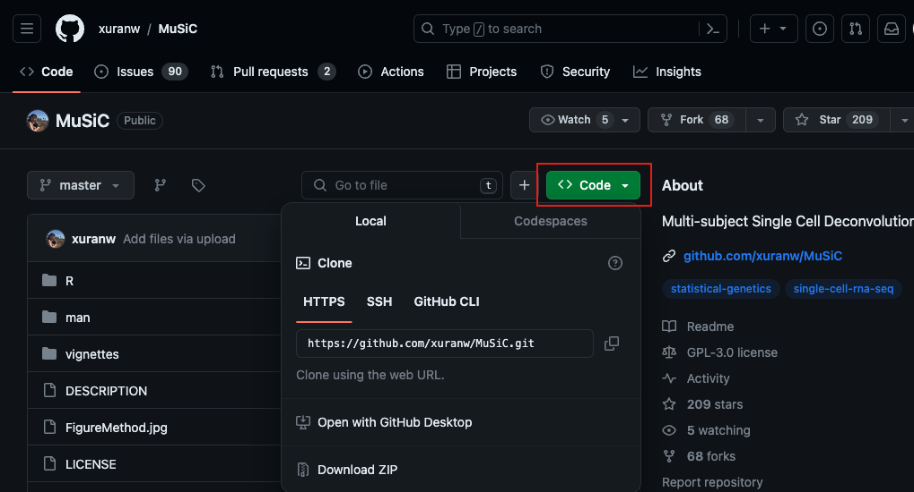
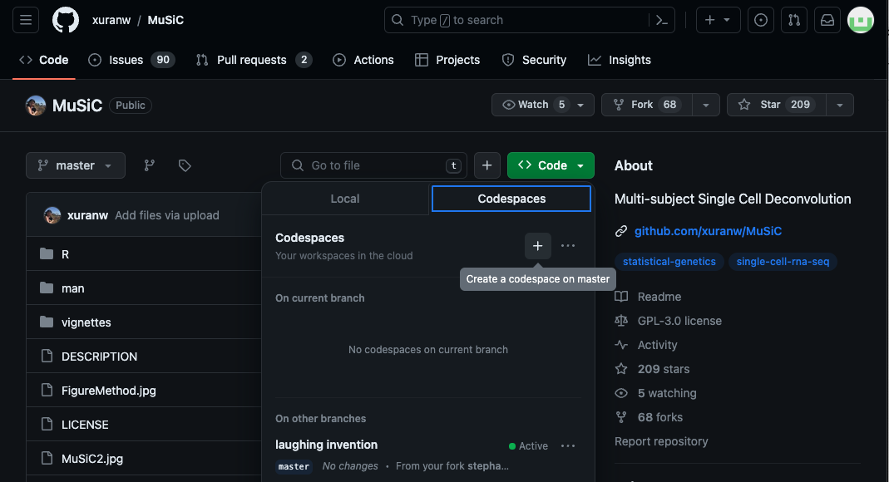
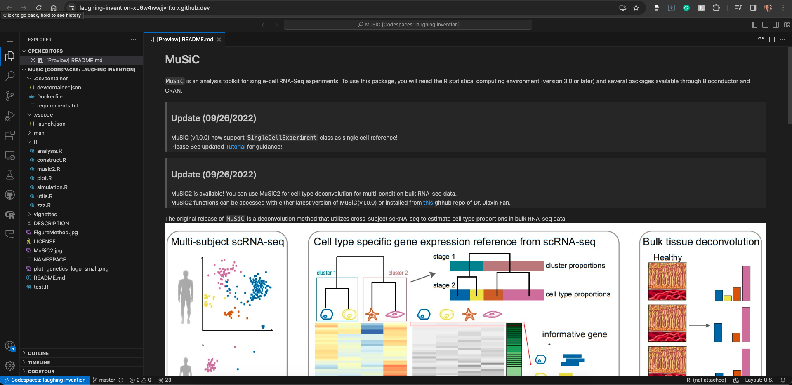

MuSiC
=============================================
`MuSiC` is an analysis toolkit for single-cell RNA-Seq experiments. To use this package, you will need the R statistical computing environment (version 3.0 or later) and several packages available through Bioconductor and CRAN.

> ## Update (01/15/2024)
> We're excited to announce two significant enhancements to the MuSiC toolkit:

> ### 1. Integration with R Devcontainer and Docker for Codespace Environments:
> - We have now enabled the setup of an R development container, specifically tailored for `MuSiC`, in a Docker environment. This allows users to seamlessly edit and run `MuSiC` in a cloud-based development environment such as GitHub Codespaces.
> - With this update, users can easily access a pre-configured R environment with all necessary dependencies and settings, ensuring a consistent and reproducible coding experience regardless of the local machine setup.

> ### 2. Enhanced Code Documentation:
> - To improve user experience and code readability, we have added comprehensive comments and annotations throughout the `MuSiC` codebase.
> - These annotations provide clear explanations for each line of code and function, assisting users in understanding the underlying logic and facilitating easier modifications or customizations to the toolkit.

> These updates are part of our ongoing efforts to make `MuSiC` more accessible and user-friendly for researchers and developers in the RNA-Seq community. We believe that these enhancements will significantly streamline the workflow for both new and experienced users of `MuSiC`.

> ## Update (09/26/2022)
>  MuSiC (v1.0.0) now support `SingleCellExperiment` class as single cell reference!<br />
> Please See updated [Tutorial](http://xuranw.github.io/MuSiC/articles/MuSiC.html) for guidance!

> ## Update (09/26/2022)
> MuSiC2 is available! You can use MuSiC2 for cell type deconvolution for multi-condition bulk RNA-seq data. <br />
> MuSiC2 functions can be accessed with either latest version of MuSiC(v1.0.0) or installed from [this](https://github.com/Jiaxin-Fan/MuSiC2) github repo of Dr. Jiaxin Fan.

The original release of `MuSiC` is a deconvolution method that utilizes cross-subject scRNA-seq to estimate cell type proportions in bulk RNA-seq data.


`MuSiC2` is an iterative algorithm aiming to improve cell type deconvolution for bulk RNA-seq data using scRNA-seq data as reference when the bulk data are generated from samples with multiple clinical conditions where at least one condition is different from the scRNA-seq reference.


How to cite `MuSiC`
-------------------
Please cite the following publications:

> *Bulk tissue cell type deconvolution with multi-subject single-cell expression reference*<br />
> <small>X. Wang, J. Park, K. Susztak, N.R. Zhang, M. Li<br /></small>
> Nature Communications. 2019 Jan 22 [https://doi.org/10.1038/s41467-018-08023-x](https://doi.org/10.1038/s41467-018-08023-x) 

> *MuSiC2: cell type deconvolution for multi-condition bulk RNA-seq data*<br />
> <small>J. Fan, Y. Lyu, Q. Zhang, X. Wang, R. Xiao, M. Li<br /></small>
> Briefings in Bioinformatics. 2022 [https://doi.org/10.1093/bib/bbac430](https://doi.org/10.1093/bib/bbac430)


Installation
------------
Both `MuSiC` and `MuSiC2` functions are available in one package.
``` r
# install devtools if necessary
install.packages('devtools')

# install the MuSiC package
devtools::install_github('xuranw/MuSiC')

# load
library(MuSiC)
```
## Special Steps for GitHub Codespaces
### What is Codespaces?
Codespaces is a feature provided by GitHub offering a cloud-based, integrated development environment (IDE). This IDE allows developers to write, run, and debug code directly within GitHub. Essentially, Codespaces delivers a complete, configurable development environment accessible anywhere via a web browser or supported code editors like Visual Studio Code.

### How to Use Codespaces

#### 1. Fork the Repository
- Click on the “Fork” button in the upper right corner of the repository page to create a copy of the repository in your GitHub account.


#### 2. Create a new Codespace
- Navigate to the repository (either the original one or your fork). Look for the "Code" dropdown button near the top of the page and click on it to see various options for working with the repository.

- Click on Codespaces, then click on the PLUS (+) sign to create a new codespace.

- If this is your first time creating a codespace for this repository, initial setup might take a while.

#### 3. Using the Codespace
- Once the Codespace is created, it will open a VS Code-like editor in your browser, complete with a terminal, code editor, and debugger.
- You can now write, edit, run, and debug code directly in your browser.


#### 4. Open RStudio
- To open RStudio Server, click the Forwarded Ports "Radio" icon at the bottom of the VS Code Online window.
- In the Ports tab, hover over the "Local Address" column for the RStudio row and click the Open in Browser "World" icon.
- This will launch RStudio Server in a new window. Log in with the username and password `rstudio/rstudio`.
  - **NOTE:** Sometimes, the RStudio window may fail to open with a timeout error. If this happens, try again, or restart the Codespace.
- In RStudio, use the File menu to open the `/music` folder and then browse to open the file `test.R`.

#### 5. Test with the `test.R` File
- Now, play around with the `test.R` file. Click on "Run" several times until you see the plot.

More Information
-----------------
Please see Tutorials for [MuSiC](http://xuranw.github.io/MuSiC/articles/MuSiC.html) and [MuSiC2](http://xuranw.github.io/MuSiC/articles/pages/MuSiC2.html).
