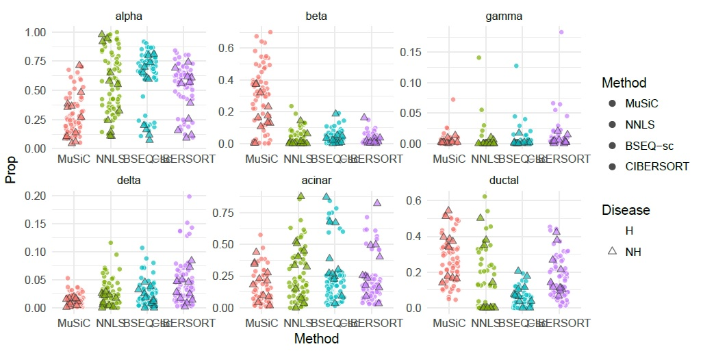
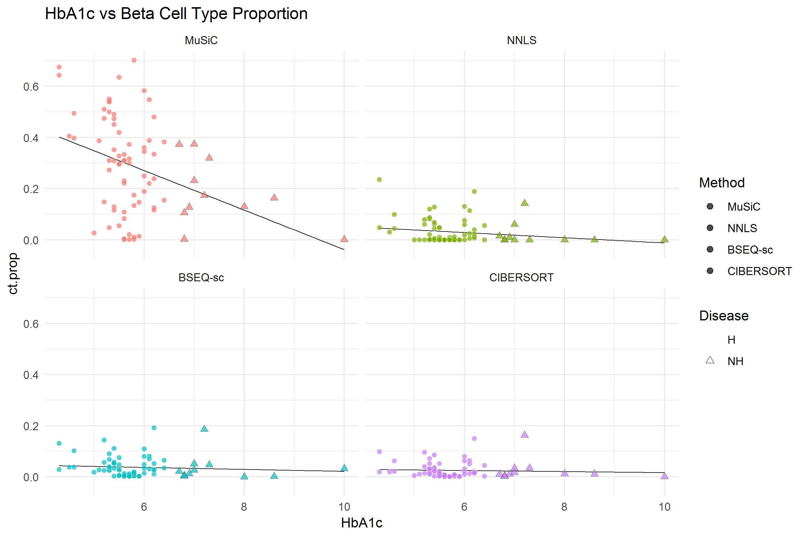

Installation
------------
``` r
# install devtools if necessary
install.packages('devtools')

# install the MuSiC package
devtools::install_github('xuranw/MuSiC')

# load
library(MuSiC)
```

Examples
--------

We reproduce here the analysis detailed in MuSiC manuscript: 

- Total gene expression data were obtained from GEO dataset [GSE50244](https://www.ncbi.nlm.nih.gov/geo/query/acc.cgi?acc=GSE50244), which contains read counts data on gobal transcriptomic analysis of bulk human pancreatic islets to study glucose metabolism in healthy and hyper-glycemic conditions (Fadista et al. 2014).

-   Single cell RNA-seq data were generated by ArrayExpress dataset [E-MTAB-5061](https://www.ebi.ac.uk/arrayexpress/experiments/E-MTAB-5061/), which contains read counts data on single cell mRNA-seq of human pancreatic islets from 10 donors, 6 healthy donors and 4 Type II diabetes donors (Segerstolpe et al. 2016). We used single cell data from 6 healthy donors as reference in deconvolution.

- Another single cell RNA-seq data were from Xin et al., which contains read counts data on single cell mRNA-seq of human pancreatic islet endocrine cells from 18 donors, 12 healthy donors and 6 Type II diabetes donors.
### Data Preparation

Bioconduct base package provides `ExpressionSet` class, which is a convenient data structure to hold expression data along with sample/feature annotation. Here we use two `ExpressionSet` objects to handle the bulk and single cell data respectively.

#### Bulk data

The dataset's [GEO entry (GSE50244)](https://www.ncbi.nlm.nih.gov/geo/query/acc.cgi?acc=GSE50244) contains raw RNA-seq and sample annotation data. For the purpose of this vignette, we will use the read counts data `GSE50244bulkeset.rds` on the [this page](https://github.com/xuranw/MuSiC/tree/master/vignettes/data). Please download this file.

``` r
# Download GSE50244 dataset from Github
GSE50244.bulk.eset = readRDS('yourpath/GSE50244bulkeset.rds')
GSE50244.bulk.eset
#ExpressionSet (storageMode: lockedEnvironment)
#assayData: 32581 features, 89 samples 
#  element names: exprs 
#protocolData: none
#phenoData
#  sampleNames: Sub1 Sub2 ... Sub89 (89 total)
#  varLabels: sampleID SubjectName ... tissue (7 total)
#  varMetadata: labelDescription
#featureData: none
#experimentData: use 'experimentData(object)'
#Annotation:  
```

#### Single cell data

The single cell data are from [ArrayExpression (E-MTAB-5061)](https://www.ebi.ac.uk/arrayexpress/experiments/E-MTAB-5061/), which contrains read counts for 25453 genes of 2209 cells. The read counts `EMTABesethealthy.rds` are available on the [this page](https://github.com/xuranw/MuSiC/tree/master/vignettes/data), in the form of an `ExpressionSet`. Please download this file.

``` r
# Download EMTAB single cell dataset from Github
EMTAB.eset = readRDS('yourpath/EMTABesethealthy.rds')
EMTAB.eset
#ExpressionSet (storageMode: lockedEnvironment)
#assayData: 25453 features, 1097 samples 
#  element names: exprs 
#protocolData: none
#phenoData
#  sampleNames: AZ_A10 AZ_A11 ... HP1509101_P9 (1097 total)
#  varLabels: sampleID SubjectName cellTypeID cellType
#  varMetadata: labelDescription
#featureData: none
#experimentData: use 'experimentData(object)'
#Annotation:  
```
Another single cell data are from [GEO entry (GSE81608)](https://www.ncbi.nlm.nih.gov/geo/query/acc.cgi?acc=GSE81608). There are 39849 genes and 1492 cells. The read counts `XinT2Deset.rds` are available on [this page](https://github.com/xuranw/MuSiC/tree/master/vignettes/data), in the form of an `ExpressionSet`. Please download this file.

```r
# Download Xin et al. single cell dataset from Github
XinT2D.eset = readRDS('yourpath/XinT2Deset.rds')
XinT2D.eset
#ExpressionSet (storageMode: lockedEnvironment)
#assayData: 39849 features, 1492 samples 
#  element names: exprs 
#protocolData: none
#phenoData
#  sampleNames: Sample_1 Sample_2 ... Sample_1492 (1492 total)
#  varLabels: sampleID SubjectName ... Disease (5 total)
#  varMetadata: labelDescription
#featureData: none
#experimentData: use 'experimentData(object)'
#Annotation:  
```

### Estimation of cell type proportions
In stead of selecting marker genes, MuSiC gives weights to each gene. The weight scheme is based on cross-subject variation: up-weight gene with low variation and down-weight gene with high variation. The composition of bulk tisue samples from there total gene expression is inferred by both cross-subject mean and variance by all genes.

#### Benchmark Evaluation
Benchmark dataset is constructed by summing up single cell data from `XinT2D.eset`. The artificial bulk data is constructed through function `bulk_construct`. The inputs are single cell dataset, cluster name (`clusters`), sample name (`samples`) and selected cell type (`select.ct`). `bulk_construct` returns a ExpressionSet of artificial bulk dataset `Bulk.counts` and a matrix of real cell type counts `num.real`.

```r
# Construct artificial bulk dataset. Use all 4 cell types: alpha, beta, gamma, delta
XinT2D.construct.full = bulk_construct(XinT2D.eset, clusters = 'cellType', samples = 'SubjectName')

# calculate cell type proportions
XinT2D.construct.full$prop.real = relative.ab(XinT2D.construct.full$num.real, by.col = FALSE)
```

The cell type proportions is estimated by function `music_prop`. We can specify the way of grouping scRNA-seq data by `cluster`. `samples` refers to different subjects and `select.ct` refers to cell type included (use all cell types in the single cell dataset if not specified). The estimated proportions are normalized based on included cell type.
```r
# Estimate cell type proportions of artificial bulk data
Est.prop.Xin = music_prop(bulk.eset = XinT2D.construct.full$Bulk.counts, sc.eset = EMTAB.eset,
                          clusters = 'cellType', samples = 'sampleID', 
                          select.ct = c('alpha', 'beta', 'delta', 'gamma'))
names(Est.prop.Xin)
#[1] "Est.prop.weighted" "Est.prop.allgene"  "Weight.gene"       "r.squared.full"    "Var.prop"  
```

`music_prop` not only provides MuSiC estimated cell type proportions (`Est.prop.weighted`), but also Non-negative least square estimated proportions (`Est.prop.allgene`). It also returns the weights (`Weight.gene`), R square (`r.squared.full`) and variance of estimated cell type proportions (`Var.prop`).

Compare the real and estimated cell type proportions via different methods.
```r
# Estimate via BSEQ-sc
B.EMTAB.full = bseqsc_basis(EMTAB.est, pancreasMarkers[c('alpha', 'beta', 'delta', 'gamma')], clusters = 'cellType', samples = 'sampleID', ct.scale = TRUE)
fit.EMTAB <- bseqsc_proportions(XinT2D.construct.full$Bulk.counts, B.EMTAB.full, verbose = TRUE)
Est.prop.bseq.Xin = t(coef(fit.EMTAB))

# Estimation evaluation

Eval_multi(prop.real = data.matrix(XinT2D.construct.full$prop.real), 
           prop.est = list(data.matrix(Est.prop.Xin$Est.prop.weighted), data.matrix(Est.prop.Xin$Est.prop.allgene), data.matrix(Est.prop.bseq.Xin)), 
           method.name = c('MuSiC', 'NNLS', 'BSEQ-sc'))

#           RMSD     mAD      R
#MuSiC   0.09881 0.06357 0.9378
#NNLS    0.17161 0.11749 0.8159
#BSEQ-sc 0.21741 0.15134 0.7880

Prop_comp_multi(prop.real = data.matrix(XinT2D.construct.full$prop.real), 
                prop.est = list(data.matrix(Est.prop.Xin$Est.prop.weighted), data.matrix(Est.prop.Xin$Est.prop.allgene), 
                data.matrix(Est.prop.bseq.Xin)), eval = FALSE, 
                method.name = c('MuSiC', 'NNLS', 'BSEQ-sc'), title = 'Heatmap of Real and Est. Proportion from Xin et al.\n Ref: EMTAB healthy' )
```


#### Real Bulk Cell Type Estimation
The deconvolution of 89 subjects from Fadista et al. can be realized by bulk data `GSE50244.bulk.eset` and single cell data `EMTAB.eset`. We constrained our estimation on 6 major cell type: alpha, beta, delta, gamma, acinar and ductal, which take up over 90% of the whole islet.

``` r
# Estimate cell type proportions
Est.prop.GSE50244 = music_prop(bulk.eset = GSE50244.bulk.eset, sc.eset = EMTAB.eset, clusters = 'cellType', 
                               samples = 'sampleID', select.ct = c('alpha', 'beta', 'delta', 'gamma', 'acinar', 'ductal'))
                               
# Estimate via BSEQ-sc
B.EMTAB = bseqsc_basis(EMTAB.est, pancreasMarkers, clusters = 'cellType', samples = 'sampleID', ct.scale = TRUE)
fit.EMTAB <- bseqsc_proportions(exprs(GSE50244.bulk.eset), B.EMTAB, verbose = TRUE)
Est.prop.bseq = t(coef(fit.EMTAB))
```
CIBERSORT estimation is abtained by using the design matrix provided by function `music_Design.matrix` and can be downloaded [here](https://github.com/xuranw/MuSiC/tree/master/vignettes/data).


```r
load('yourpath/GSE50244CIBERSORT.RData')

# Jitter plot of estimated cell type proportions
m.prop.GSE50244 = rbind(melt(GSE50244.EMTAB.prop$Est.prop.weighted), 
                        melt(GSE50244.EMTAB.prop$Est.prop.allgene), melt(Est.prop.bseq),
                        melt(data.matrix(Est.prop.cibersort)))

colnames(m.prop.GSE50244) = c('Sub', 'CellType', 'Prop')
m.prop.GSE50244$CellType = factor(m.prop.GSE50244$CellType, levels = c('alpha', 'beta', 'delta', 'gamma', 'acinar', 'ductal'))
m.prop.GSE50244$Method = factor(rep(c('MuSiC', 'NNLS', 'BSEQ-sc', 'CIBERSORT'), each = 89*6), levels = c('MuSiC', 'NNLS', 'BSEQ-sc', 'CIBERSORT'))
m.prop.GSE50244$HbA1c = rep(GSE50244.bulk.eset$hba1c, 4*6)
m.prop.GSE50244 = m.prop.GSE50244[!is.na(m.prop.GSE50244$HbA1c), ]
m.prop.GSE50244$Disease = factor(c('H', 'NH')[(m.prop.GSE50244$HbA1c > 6.5)+1], levels = c('H', 'NH'))
m.prop.GSE50244$D = (m.prop.GSE50244$Disease == 'NH')/5
m.prop.GSE50244 = rbind(subset(m.prop.GSE50244, Disease == 'H'), subset(m.prop.GSE50244, Disease != 'H'))

ggplot(m.prop.GSE50244, aes(Method, Prop)) + 
  geom_point(aes(fill = Method, color = Disease, stroke = D, shape = Disease), size = 2, alpha = 0.7, position = position_jitter(width=0.25, height=0)) +
  facet_wrap(~ CellType, scales = 'free') + scale_colour_manual( values = c('white', "gray20")) +
  scale_shape_manual(values = c(21, 24))+ theme_minimal()
```


Constrain our analysis on beta cells
```r
# Create dataframe for beta cell proportions and HbA1c levels
m.prop.ana = data.frame(Age = rep(pData(GSE50244.bulk.eset)$age, 4), BMI = rep(pData(GSE50244.bulk.eset)$bmi, 4), HbA1c = rep(pData(GSE50244.bulk.eset)$hba1c, 4),
                        Gender = rep(pData(GSE50244.bulk.eset)$gender, 4),
                        ct.prop = c(data.matrix(GSE50244.EMTAB.prop$Est.prop.weighted[, 2]), GSE50244.EMTAB.prop$Est.prop.allgene[, 2], Est.prop.bseq[, 2], Est.prop.cibersort[, 2]), 
                        Method = factor(rep( c('MuSiC', 'NNLS', 'BSEQ-sc', 'CIBERSORT'), each = 89), levels =  c('MuSiC', 'NNLS', 'BSEQ-sc', 'CIBERSORT')) )
m.prop.ana.h = subset(m.prop.ana, !is.na(HbA1c))
m.prop.ana.h$Disease = factor( c('H', 'NH')[(m.prop.ana.h$HbA1c > 6.5) + 1], c('H', 'NH') )
m.prop.ana.h$D = (m.prop.ana.h$Disease == 'NH')/5

ggplot(m.prop.ana.h, aes(HbA1c, ct.prop)) + geom_smooth(method = 'lm',  se = FALSE, col = 'black', lwd = 0.25) +
  geom_point(aes(fill = Method, color = Disease, stroke = D, shape = Disease), size = 2, alpha = 0.7) +  facet_wrap(~ Method) + 
  ggtitle('HbA1c vs Beta Cell Type Proportion') + theme_minimal() + scale_colour_manual( values = c('white', "gray20")) + 
  scale_shape_manual(values = c(21, 24))
```

